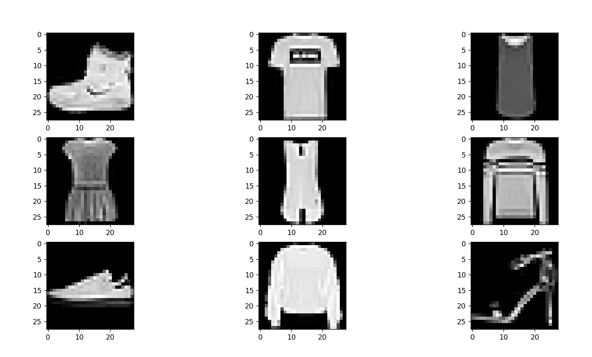

# Welcome to MLOps homework repository

This repository includes python code related to mlops homework. The repo contains training, evaluating fashion mnist dataset and saving, checkpointing the model. The model is served on localhost with tf_serving docker image.

- To setup the virtual environment from windows run create_env.ps1 from the repo root.
- If you are a contributor, please don't forget to call 'pre-commit install' to activate pre-commit hooks
- After environment is ready to train and evaluate the model activate .venv virtual environment and run the 'python mlops/main.py' command. This will train and evaluate the model.
- In order to run the docker container first install docker pull tensorflow/serving with docker pull tensorflow/serving, then run setup configuration in config.json in repo root. Currently before running the tf_serving.ps1 powershell script to serve the model you need to modify the model path in the powershell script but later this is planned to be fixed. After every of these configurations are set please run the tf_serving.ps1 script in order to serve the model on localhost
- To send predictions you can use the mlops/predict.py script.

## Useful links

- https://towardsdatascience.com/designing-ml-orchestration-systems-for-startups-202e527d7897
- https://moez-62905.medium.com/build-machine-learning-pipeline-in-python-and-package-it-as-a-docker-container-13f28972fb2b
- https://medium.com/@umeshnmenon/ml-model-orchestration-recommendations-35702b27e2b2
- https://medium.com/code-wild/building-a-machine-learning-orchestration-platform-part-1-d1ae7e03f9b9
- https://neptune.ai/blog/how-to-serve-machine-learning-models-with-tensorflow-serving-and-docker
- https://towardsdatascience.com/checkpointing-deep-learning-models-in-keras-a652570b8de6
- https://machinelearningmastery.com/check-point-deep-learning-models-keras/
- https://neptune.ai/blog/ml-metadata-store#:~:text=To%20manage%20all%20that%20metadata%2C%20you%20may%20use,tools%2C%20experiment%20tracking%20tools%2C%20or%20software%20monitoring%20solutions
- https://machinelearningmastery.com/how-to-develop-a-cnn-from-scratch-for-fashion-mnist-clothing-classification/
